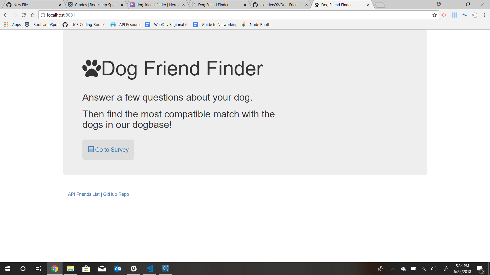
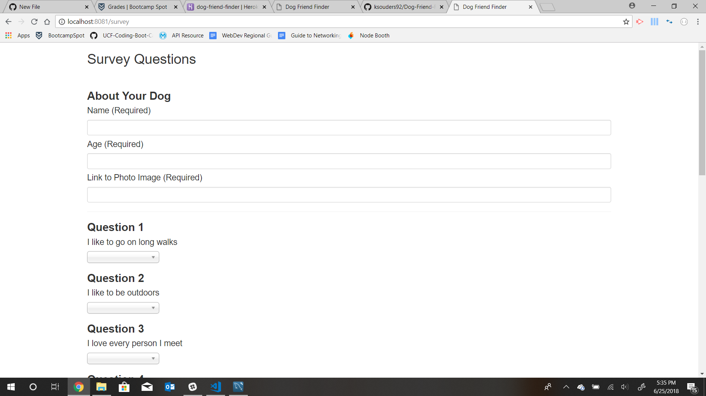
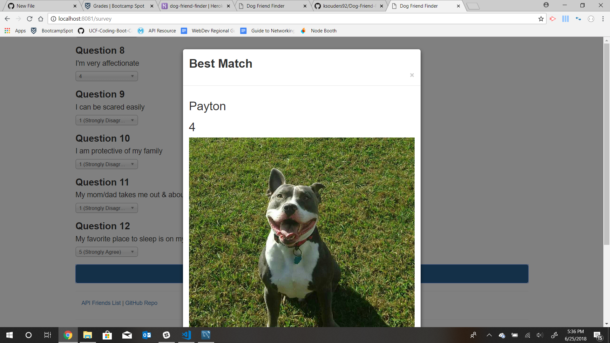

# Dog-Friend-Finder
UCF Coding Bootcamp Week 13 Homework

## Functionality
Using Node.js and routes a users request (information survey filled out about their dog) will respond with a "best match" for their dog from 
one of the dogs in the API I created previously.

## Screen Shots

## Deployment
* Github: https://github.com/ksouders92/Dog-Friend-Finder
* Heroku: https://dog-friend-finder.herokuapp.com/

